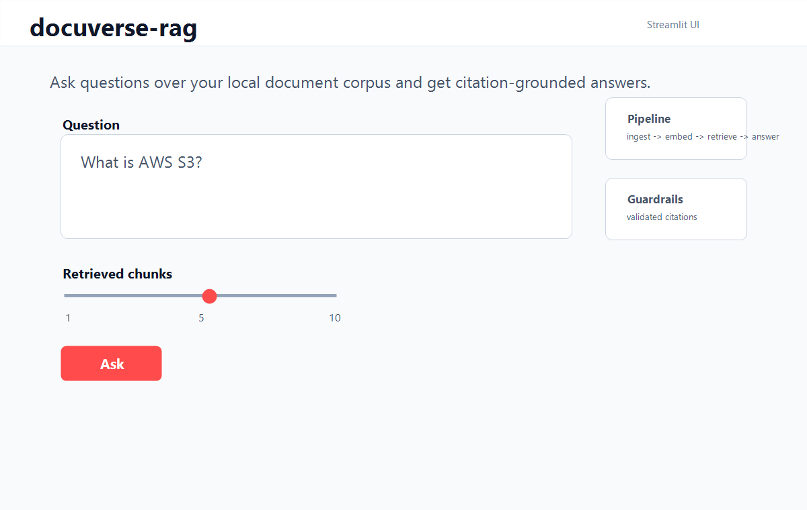
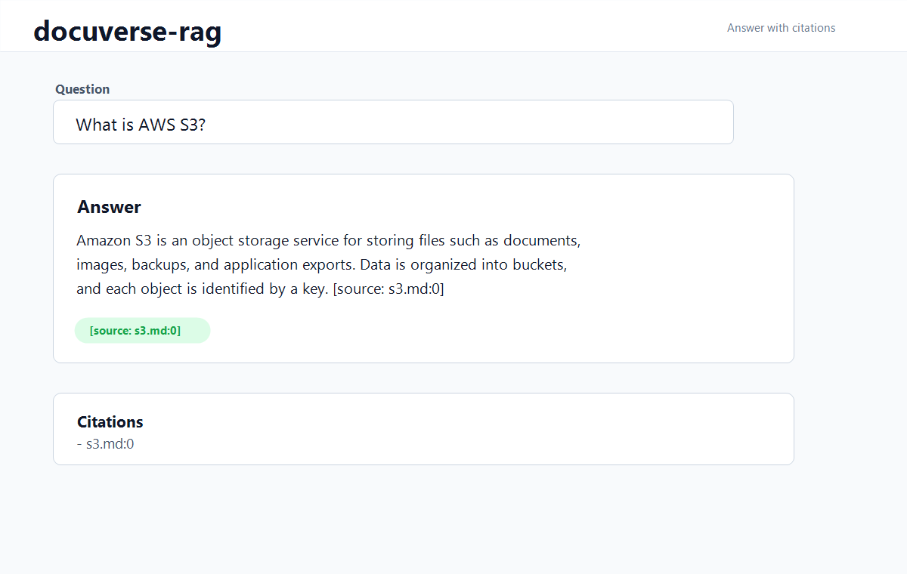
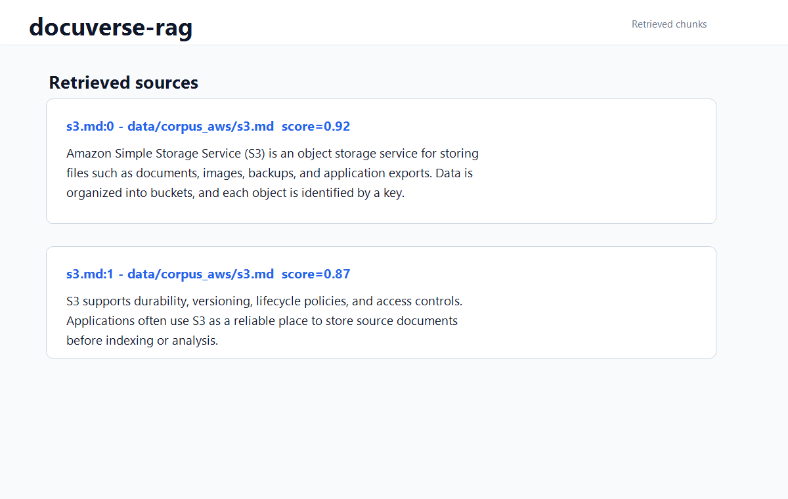
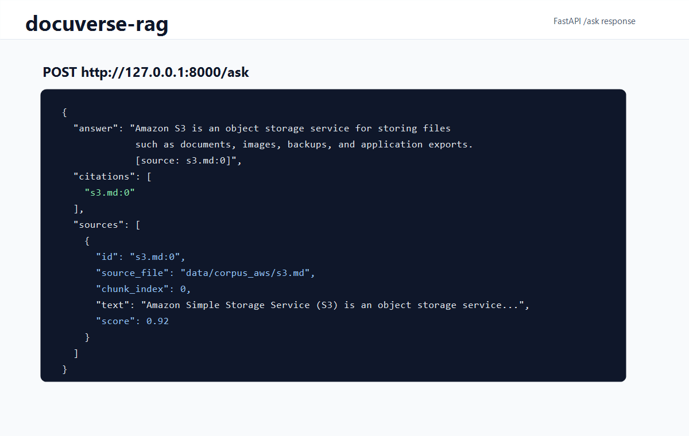
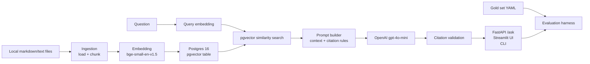

# docuverse-rag

[](https://www.python.org/)
[](https://fastapi.tiangolo.com/)
[](https://streamlit.io/)
[](https://www.postgresql.org/)
[](https://github.com/pgvector/pgvector)
[](.github/workflows/ci.yml)

Production-style Retrieval-Augmented Generation (RAG) system with local
embeddings, PostgreSQL + pgvector retrieval, citation validation, a FastAPI API,
a Streamlit UI, and a small evaluation harness.

I built this to understand the backend pieces around RAG, not just the final LLM
call. The project is small, but it covers the full path: load documents, chunk
them, embed them, store vectors, retrieve context, build a prompt, validate
citations, expose an API, and run a basic evaluation set.

## Demo Preview

Screenshots are intended to live under `docs/images/`. The repository includes
demo screenshots to show the intended flow: Streamlit UI, cited answer,
retrieved chunks, and API response. Some screenshots may be static demo assets
when the full live environment is not running.









## Problem Statement

Teams often keep useful knowledge in markdown files, runbooks, notes, and cloud
docs. A basic chat box over those files is not enough if the answer cannot show
where it came from or if retrieval changes silently make results worse.

docuverse-rag handles a focused version of that problem. It creates a searchable
document QA pipeline where answers are expected to cite the retrieved chunks that
support them.

## Why This Project Matters

I wanted a project that goes beyond calling an LLM API. The main goal was to
build the surrounding backend system: document ingestion, embedding, storage,
retrieval, citation checks, API/UI surfaces, and evaluation. Those pieces are
where a RAG system usually becomes easier or harder to debug.

## Key Features

- Local document ingestion for markdown and text files
- Overlapping text chunking with stable chunk metadata
- Sentence Transformers embeddings using `BAAI/bge-small-en-v1.5`
- PostgreSQL 16 plus pgvector storage for vector similarity search
- Cosine-similarity retrieval over stored chunks
- Citation-grounded answer generation with OpenAI `gpt-4o-mini`
- FastAPI `/health` and `/ask` endpoints
- Streamlit UI for visual question answering
- YAML-based evaluation harness with deterministic fact and citation scoring
- CI-friendly tests with mocked model, database, and LLM calls

## Architecture Overview



For more detail, see [docs/ARCHITECTURE.md](docs/ARCHITECTURE.md).

## Retrieval Flow

1. `docuverse.ingest` reads `.md` and `.txt` files from a local directory.
2. Documents are split into overlapping chunks with `chunk_id`, `source_file`,
   `chunk_index`, and `text`.
3. `docuverse.embed` embeds chunk text with `BAAI/bge-small-en-v1.5`.
4. `docuverse.store` creates the pgvector schema and stores chunk embeddings.
5. `docuverse.retrieve` embeds the user query and searches with pgvector cosine
   distance.
6. `docuverse.prompt` builds a constrained prompt from retrieved context.
7. `docuverse.answer` calls the LLM, extracts citations, and rejects citations
   that do not match retrieved chunks.

## Tech Stack

| Layer | Choice |
| --- | --- |
| Runtime | Python 3.11 |
| API | FastAPI, Pydantic |
| UI | Streamlit |
| Embeddings | Sentence Transformers, `BAAI/bge-small-en-v1.5` |
| Vector storage | PostgreSQL 16, pgvector |
| LLM | OpenAI SDK, `gpt-4o-mini` |
| Evaluation | PyYAML gold set, deterministic scoring |
| Tests | pytest, FastAPI TestClient, monkeypatch-based fakes |
| Dev ops | Docker Compose, GitHub Actions |

## Why These Design Choices?

**pgvector** keeps vector search close to relational metadata. For this scope,
that was simpler than adding a separate vector database before the project
needed one.

**`BAAI/bge-small-en-v1.5`** is a practical local embedding model: small enough
for local development, strong enough for a small semantic retrieval demo, and
widely used enough to be a reasonable default.

**Citation validation** turns citation format from a prompt suggestion into a
runtime check. It does not prove every sentence is correct, but it reduces
unsupported citations by checking that cited chunk IDs were actually retrieved.

**FastAPI** gives the project a clear service boundary, typed request/response
models, validation, and straightforward tests with `TestClient`.

**Evaluation harness** gives the project a small regression check. The current
scorer is deliberately simple, but it is better than only eyeballing one answer
at a time.

## Challenges & Tradeoffs

### Why pgvector instead of Pinecone/Weaviate?

pgvector keeps infrastructure simple and colocates vectors with relational
metadata. Postgres already stores chunk text, source file, chunk index, and IDs,
so keeping embeddings there avoids another service while still supporting real
vector search.

### Why `BAAI/bge-small-en-v1.5`?

`BAAI/bge-small-en-v1.5` balances semantic retrieval quality with local
development cost. It produces 384-dimensional embeddings and is small enough to
use while building the rest of the pipeline.

### Why character chunking first?

Character chunking is deterministic, easy to inspect, and straightforward to
test. It is not the final word on chunking quality, but it is a good first
implementation because failures are visible and reproducible. A future version
can move to token-aware chunking once the retrieval baseline is established.

### Why citation validation?

Prompting alone does not guarantee grounded answers. The answer layer validates
that every cited chunk ID was actually part of the retrieved context, which
reduces unsupported references and makes citations a runtime contract instead of
only a formatting request.

### Why an evaluation harness?

Manual QA is useful but inconsistent. The YAML gold set gives the project a
simple regression check for expected facts and expected sources, which makes
retrieval and prompting changes easier to compare.

## Known Limitations

- The current corpus is small and sample-based.
- Chunking is character-based, not token-aware.
- The evaluation harness is lightweight and deterministic.
- PDF, table, and scanned document extraction are not implemented yet.
- Answer quality depends heavily on whether retrieval finds the right chunks.
- `OPENAI_API_KEY` is required for answer generation.
- Screenshots may be static demo screenshots if the full live environment is not
  running.

## System Characteristics

- 384-dimensional embeddings from `BAAI/bge-small-en-v1.5`
- Cosine similarity retrieval through pgvector
- Deterministic YAML-based evaluation harness
- pytest coverage for ingestion, embeddings, storage, retrieval, prompting,
  answer generation, API behavior, UI error handling, and evaluation
- Local corpus evaluation using the included AWS S3/IAM sample documents
- Dockerized PostgreSQL 16 with pgvector initialization

## Evaluation Harness

The evaluation harness lives in [eval/gold_set.yaml](eval/gold_set.yaml). It
contains 10 questions over the sample AWS corpus, each with expected facts and
expected source files.

Run it with:

```powershell
python -m docuverse.evaluate eval/gold_set.yaml
```

Current scoring is deterministic:

- `fact_score`: percentage of expected facts found in the answer text
- `citation_score`: `1` when at least one expected source is cited, otherwise `0`
- invalid citations fail the item

This is not meant to replace human review. It is a first regression signal that
can evolve into richer retrieval and answer-quality checks.

## Local Setup

Create and activate a virtual environment:

```powershell
py -3.11 -m venv .venv
.\.venv\Scripts\Activate.ps1
```

Install the project:

```powershell
python -m pip install --upgrade pip
python -m pip install -e .
```

Run tests:

```powershell
python -m pytest
```

Start Postgres with pgvector:

```powershell
docker compose up -d postgres
```

Load the sample AWS corpus into pgvector:

```powershell
python -m docuverse.store data/corpus_aws
```

Set your OpenAI API key:

```powershell
$env:OPENAI_API_KEY = "your-api-key"
```

## API Usage

Start the API:

```powershell
python -m uvicorn docuverse.api:app --reload
```

Health check:

```powershell
Invoke-RestMethod http://127.0.0.1:8000/health
```

Ask a question:

```powershell
$body = @{
    question = "What is AWS S3?"
    top_k = 5
} | ConvertTo-Json

Invoke-RestMethod `
    -Uri http://127.0.0.1:8000/ask `
    -Method Post `
    -ContentType "application/json" `
    -Body $body
```

Expected response shape:

```json
{
  "answer": "S3 is an object storage service... [source: s3.md:0]",
  "citations": ["s3.md:0"],
  "sources": [
    {
      "id": "s3.md:0",
      "source_file": "data/corpus_aws/s3.md",
      "chunk_index": 0,
      "text": "...",
      "score": 0.92
    }
  ]
}
```

## Streamlit Demo

Run the UI:

```powershell
streamlit run src/docuverse/ui.py
```

The UI provides a question box, a `top_k` slider, answer display, citations, and
an expandable source inspection area. It also surfaces common setup errors like
a missing `OPENAI_API_KEY`, unavailable database, or empty chunk store.

## Project Structure

```text
docuverse-rag/
|-- data/corpus_aws/          # Small sample markdown corpus
|-- docker/postgres/init.sql  # pgvector extension initialization
|-- docs/                     # Architecture and learning notes
|-- eval/gold_set.yaml        # Evaluation questions and expected facts
|-- src/docuverse/
|   |-- api.py                # FastAPI service
|   |-- answer.py             # LLM answer generation and citation validation
|   |-- embed.py              # Sentence Transformers embedding layer
|   |-- evaluate.py           # Evaluation harness
|   |-- ingest.py             # Local document loading and chunking
|   |-- prompt.py             # Context and prompt construction
|   |-- retrieve.py           # pgvector similarity retrieval
|   |-- store.py              # Postgres/pgvector persistence
|   `-- ui.py                 # Streamlit interface
`-- tests/                    # Unit tests with mocked external systems
```

## Future Improvements

- Add migration tooling for schema changes
- Store document-level metadata separately from chunk rows
- Add hybrid search with keyword plus vector ranking
- Track evaluation results over time in CI artifacts
- Add integration tests behind an optional Postgres service
- Support PDF ingestion and richer document parsing
- Add streaming answer responses in the API and UI
- Improve scoring with semantic similarity and citation coverage checks

## Lessons Learned

RAG quality came down to more than I expected. The model call matters, but chunk
IDs, metadata, retrieval queries, citation checks, and evaluation cases are what
make the answer path understandable when something goes wrong.

I underestimated how much retrieval quality depends on chunking. Keeping the
first chunker simple made the project easier to test, but it also made the next
improvement obvious: token-aware chunking would be worth adding.

The best decision was keeping each pipeline stage small. Mocking the model,
database, and OpenAI calls kept CI reliable, and pgvector was enough for this
scope without adding a separate vector DB.

For a more personal write-up, see [docs/LESSONS.md](docs/LESSONS.md).
